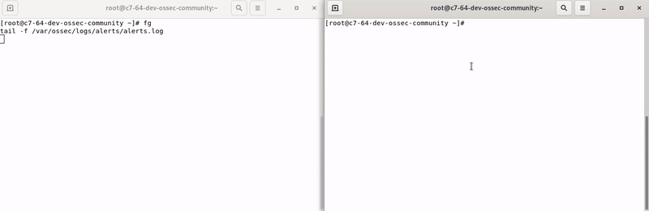
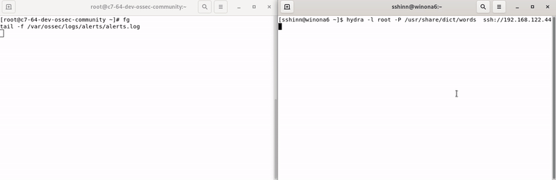

<div align="center">

# OpenArmor HIDS


**Because your servers deserve better than a 'Please don't hack me' sticky note.**

[Website](https://www.theopenarmor.org) • [Docs](https://www.theopenarmor.org/docs/) • [Downloads](https://www.theopenarmor.org/downloads/) • [Community](https://discord.gg/BXzM75Xzq7)

[](https://travis-ci.org/openarmor/openarmor-hids)
[](https://scan.coverity.com/projects/1847)
[](LICENSE)
[](https://github.com/openarmor/openarmor-hids/stargazers)

</div>

## 🛡️ About OpenArmor HIDS

OpenArmor HIDS is a powerful fork of OSSEC, offering an enhanced open-source host-based intrusion detection system. It brings modern security capabilities to your infrastructure:

- 📜 Log analysis
- 🔍 File integrity monitoring
- 📊 Policy enforcement
- 🕵️ Rootkit detection
- ⚡ Real-time alerting
- 🛠️ Active response

Our mission is to modernize and extend OSSEC's capabilities within the OpenArmor framework, providing improved security and seamless integration for contemporary environments.

## 🚀 Getting Started

```bash
git clone https://github.com/openarmor/openarmor-hids.git
cd openarmor-hids
./install.sh
```

For detailed installation instructions, check our [documentation](https://www.theopenarmor.org/docs/).

## 📸 Features in Action

<details>
<summary>File Integrity Monitoring</summary>

</details>

<details>
<summary>Attack Detection</summary>

</details>

## 🤝 Community & Support

- [Discord](https://discord.gg/BXzM75Xzq7)
- [Slack](https://openarmor.slack.com) (Invite: slack@theopenarmor.org)

## 🙏 Credits

OpenArmor HIDS stands on the shoulders of giants. We're grateful to:

- The OSSEC project
- OpenSSL Project
- zlib project
- cJSON project
- [Atomicorp](https://www.atomicorp.com) for hosting the annual OpenArmor conference

## 📄 License

OpenArmor HIDS is open-source software licensed under the [GNU General Public License v2.0](LICENSE).

---

<div align="center">
Made with ❤️ by the OpenArmor community
</div>
